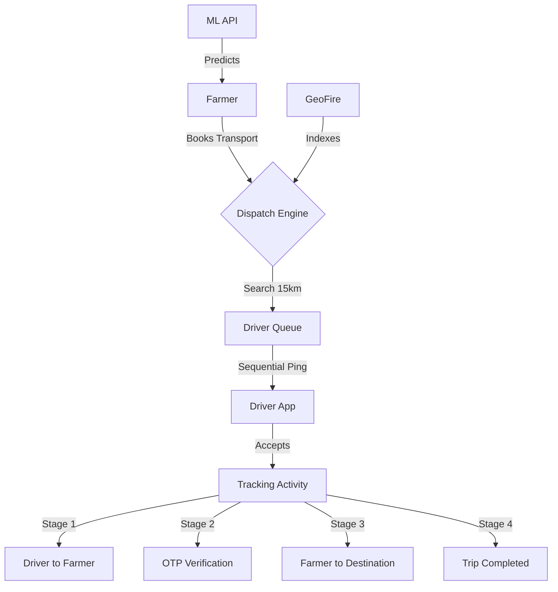

# AgriGo 🚜💨
**Modernizing Rural Logistics & Agricultural Services**

AgriGo is a premium, Rapido-style logistics and ride-hailing platform specifically designed for the agricultural sector. It connects farmers with transport drivers, laborers, and machinery providers through a real-time, map-centric ecosystem.

---

## 🌟 Key Features

### 🚜 For Farmers
- **Rapido-Style Transport Booking**: Book vehicles (Auto, Mini Truck, Lorry) with real-time tracking.
- **ML Vehicle Prediction**: Smart system that predicts the best vehicle type based on crop type and weight using a Python-based ML model.
- **Service Marketplace**: One-tap access to labor booking (Harvesting, Sowing, etc.) and heavy machinery rental.
- **Live Tracking**: Monitor your transport's arrival and trip progress with smooth map markers.
- **OTP Verification**: Secure ride starts using real-time 4-digit OTP verification.

### 🚛 For Drivers & Providers
- **Sequential Dispatching**: Intelligent request matching based on proximity (15km radius) and vehicle type.
- **Real-time Navigation**: Turn-by-turn road-based routing using Google Directions API with OSRM fallback.
- **Earnings Dashboard**: Track daily earnings, trip history, and pending requests.
- **Availability Toggle**: Simple online/offline switch to control work hours and visibility to farmers.

### 🌐 Core System
- **Dual Language Support**: Seamlessly switch between **English** and **Telugu** (persistently saved via AppCompatDelegate).
- **Real-time Sync**: Powered by Firebase Firestore for instant status updates and location tracking.
- **Smooth Animations**: High-fidelity map marker interpolation for fluid vehicle movement.

---

## 🔄 App Workflow (The Lifecycle)

AgriGo follows a sophisticated "Request-to-Receipt" lifecycle:

### 1. The Booking Phase (Farmer)
*   Farmer enters crop details (type, weight).
*   App calls an external **Machine Learning API** to suggest the optimal vehicle.
*   Farmer selects a drop-off point on an interactive map.
*   Request is stored in Firestore with status `REQUESTED`.

### 2. The Dispatching Phase (System)
*   The system scans a **15km radius** for available drivers matching the vehicle type.
*   Drivers are placed in a queue sorted by distance.
*   **Sequential Pinging**: The nearest driver gets a 30-second window to accept. If they decline or timeout, the request moves to the next nearest driver automatically.

### 3. The Tracking Phase (Live)
*   **Stage 1 (Pickup)**: Driver navigates to the farmer. Both see live movement on the map.
*   **Stage 2 (OTP)**: Upon arrival, the driver requests an OTP from the farmer to verify the pickup and start the trip.
*   **Stage 3 (Trip)**: The app switches routing to the final destination.
*   **Stage 4 (Completion)**: Driver completes the trip, triggers earnings calculation, and returns to "Available" status.

---

## 📁 Folder Structure

The project is organized using a **Modular Android Architecture**:

- **`app/src/main/java/com/agrigo/`**
    - **`activities/`**: Contains the UI logic for every screen (Booking, Tracking, Dashboards).
    - **`services/`**: Background services (e.g., `DriverDispatchService`) for continuous GPS updates.
    - **`utils/`**: Core helper classes for Map rendering, Marker animations, and Localization.
    - **`network/`**: Retrofit client configuration for ML API communication.
    - **`adapters/`**: RecyclerView adapters for listing jobs, requests, and earnings.
    - **`models/`**: Data objects representing Drivers, Requests, and Laborers.

- **`app/src/main/res/`**
    - **`layout/`**: XML definitions for the modern, card-based UI.
    - **`drawable/`**: Custom assets including 3D-styled vehicle markers.
    - **`values-te/`**: Dedicated Telugu translation resource files.

---

## 🏗️ Technical Architecture

### System Flow Diagram


### Tech Stack
- **Frontend**: Android (Java), Google Maps SDK
- **Backend**: Firebase Authentication, Cloud Firestore, Cloud Messaging
- **Logic**: GeoFireUtils (GeoHash indexing), OSRM/Google Directions (Routing)
- **AI/ML**: Python/Flask API (Deployed on Render)
- **Security**: Local.properties secret injection

---

## 🚀 Getting Started

### Prerequisites
- Android Studio Iguana or newer
- Java 11+
- Firebase Project
- Google Maps API Key

### Installation

1. **Clone the Repository**
   ```bash
   git clone https://github.com/YourUsername/AgriGo.git
   ```

2. **Configure Secrets**
   AgriGo uses `local.properties` to keep API keys secure. Create a `local.properties` file in the root directory:
   ```properties
   MAPS_API_KEY=your_google_maps_key
   ML_API_BASE_URL=https://your-ml-api.onrender.com/
   ```

3. **Firebase Setup**
   - Add your `google-services.json` to the `app/` directory.
   - Enable Email/Password Auth and Firestore in the Firebase Console.

---

## ⚖️ License
Distributed under the MIT License. See `LICENSE` for more information.

---
**Developed with ❤️ for the Agricultural Community.**
